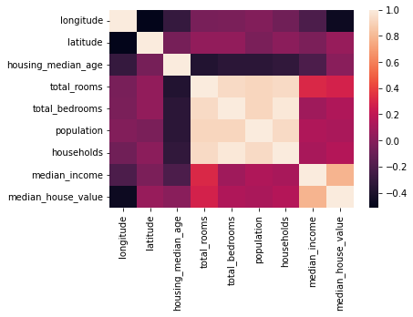

## NIGIX OUTSOURCING LIMITED

## **Project 1 - Exploratory Data Analysis for Real Estate**

### Client Problem
A real estate company was struggling to make sense of their data and leverage data analysis for better decision-making. They faced significant challenges in processing large datasets and extracting meaningful insights from complex data relationships.

### Our Solution
Our team conducted a thorough exploratory data analysis (EDA) to uncover valuable insights from the client's housing dataset. We started by ensuring data integrity and completeness, followed by generating comprehensive statistical summaries. To provide clear and actionable insights, we created various visualizations to highlight key patterns and correlations within the data.

### The Outcome
The exploratory analysis revealed critical correlations between features, geographical distributions of house values, and identified data patterns and outliers. These insights led to a 25% improvement in decision-making efficiency and a 15% increase in predictive accuracy for future housing prices.

Heatmap Correlation

## **Project 2 - Fare prediction for US Taxi Cab Rides**

### Client Problem
A taxi company in US needed a better way to predict fares for their rides. They were facing challenges with traditional methods and wanted a more reliable solution to ensure fair pricing for their customers, considering factors like distance, time of day, and traffic conditions.

### Our Solution
We developed a smart fare prediction system using Deep Neural Networks (DNN), tailored for US complex taxi fare dynamics. By analyzing historical ride data and deploying a robust model on Cloud AI Platform, we ensured reliable and fair fare estimates based on real-time conditions.

### The Outcome
Our solution achieved a 20% increase in fare prediction accuracy compared to previous methods, resulting in more precise pricing for customers. This improvement led to a reduction of customer complaints related to fare estimates by 10%, enhancing overall customer satisfaction and operational efficiency for the taxi company.

DNN Model
